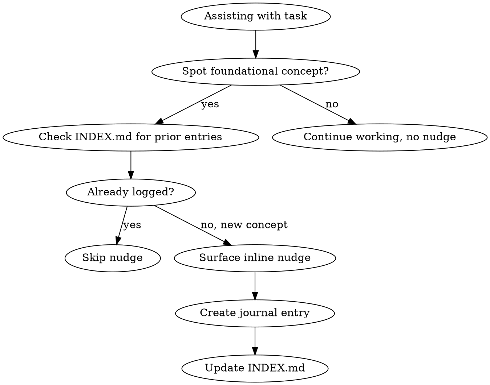

# Foundational Learning Radar

## Overview

Automatically identify foundational CS/engineering concepts as they surface during normal work. Surface max 1-2 short nudges per conversation and log richer detail to a persistent learning journal.

**Core principle:** Look past the tool/framework to the underlying principle. Not "Express middleware" but "chain of responsibility pattern." Not "Terraform modules" but "declarative vs imperative paradigms."

## When to Use

- Any software engineering task: writing code, debugging, reviewing, infrastructure work
- Skip if user is in a time-pressured debugging session (read the room)
- Skip if no genuinely foundational concept surfaces (don't force it)

## How It Works



### Step 1: Identify Concepts

While working, watch for foundational concepts in 4 categories:

| Category | Examples |
|----------|----------|
| **Design Principles** | SOLID, DRY, KISS, composition over inheritance, separation of concerns, chain of responsibility |
| **Underlying Technology** | TCP/IP, HTTP/2, TLS handshake, DNS resolution, how runtimes work, event loops |
| **CS Fundamentals** | Data structures, algorithms, concurrency models, type systems, memory management |
| **Operational Patterns** | Observability, circuit breakers, backpressure, capacity planning, graceful degradation |

### Step 2: Map Work to Deeper Concept

Always ask: "What foundational principle makes this work?"

| Surface-Level Task | Foundational Concept |
|--------------------|---------------------|
| Express middleware ordering | Chain of responsibility pattern |
| Building a streaming API | Server-sent events / HTTP/2 multiplexing |
| Writing Terraform modules | Declarative vs imperative paradigms / dependency graphs |
| Setting up CI/CD | Build reproducibility / artifact immutability |
| Adding retry logic | Exponential backoff / circuit breaker pattern |
| Database migrations | ACID properties / schema evolution strategies |
| Health check endpoints | Liveness vs readiness probes / fail-fast principle |
| Configuring TLS certs | Public key infrastructure / certificate chain of trust |

### Step 3: Check Prior Entries

Read `~/.claude/learning-journal/INDEX.md`. If the concept is already logged, skip the nudge. Prefer new concepts the user hasn't encountered before.

### Step 4: Surface Inline Nudge (Max 1-2 Per Conversation)

Use this exact format, placed naturally after the relevant part of your response:

```
> **Learning Radar** — *[Concept Name]* ([Category]). Logged to journal.
```

Example:
> **Learning Radar** — *Chain of Responsibility Pattern* (Design Principles). Logged to journal.

### Step 5: Create Journal Entry

Create a file at `~/.claude/learning-journal/YYYY-MM-DD-concept-slug.md`:

```markdown
---
concept: [Concept Name]
category: [Design Principles | Underlying Technology | CS Fundamentals | Operational Patterns]
date: YYYY-MM-DD
context: [Brief description of what user was working on]
---

## Why This Matters

[1-2 short paragraphs connecting this concept to the user's current work. Keep it concrete and actionable — explain the principle, not the tool. Max ~150 words.]

## Underlying Principle

**[Design Principle / CS Fundamental name]** — [One sentence naming and defining the abstract principle this experience exemplifies. What would break if this principle didn't exist?]

→ *If this principle has not appeared in the journal before, also create a standalone [Design Principles | CS Fundamentals] entry for it.*

## Recommended Reading

- [Resource 1 — title and author/source]
- [Resource 2 — title and author/source]
- [Resource 3 — title and author/source (optional)]
```

**Cross-category extraction rule:** When writing an Operational Patterns entry, the `## Underlying Principle` section must name the abstract Design Principle or CS Fundamental it is an instance of. If that principle has no standalone entry in the journal yet, create one immediately after — this is how the Design Principles and CS Fundamentals categories grow.

### Step 6: Update INDEX.md

Add the new entry under the appropriate category in `~/.claude/learning-journal/INDEX.md`:

```markdown
- [YYYY-MM-DD — Concept Name](YYYY-MM-DD-concept-slug.md) — one-line context
```

## Frequency Control

- **Max 1-2 nudges per conversation.** If multiple concepts surface, pick the most impactful one.
- Only nudge if the concept is genuinely foundational — not trivial, not surface-level.
- If the user is clearly time-pressured or debugging urgently, skip entirely.
- Never interrupt flow. Place the nudge after you've completed the relevant help.

## Red Flags — When NOT to Nudge

- Concept is tool-specific, not foundational (e.g., "Express routing syntax" is not a nudge)
- User is in a rush or debugging a production incident
- You've already nudged twice in this conversation
- The concept is already in INDEX.md

## Common Mistakes

| Mistake | Fix |
|---------|-----|
| Nudging on surface-level tool knowledge | Ask "what principle makes this work?" and nudge on THAT |
| Too many nudges, disrupting flow | Hard limit: 2 per conversation. Prefer 1. |
| Forgetting to check INDEX.md | Always check before nudging to avoid duplicates |
| Vague journal entries | Tie "Why This Matters" directly to the current task |
| Generic reading recommendations | Pick specific chapters/articles, not entire textbooks |
| Skipping `## Underlying Principle` | Every entry must name the abstract principle. If you can't name it, you haven't found the right depth yet. |
| Letting Design Principles / CS Fundamentals stay empty | Every Operational Patterns entry that names a new principle must also produce a standalone entry in that category. |
