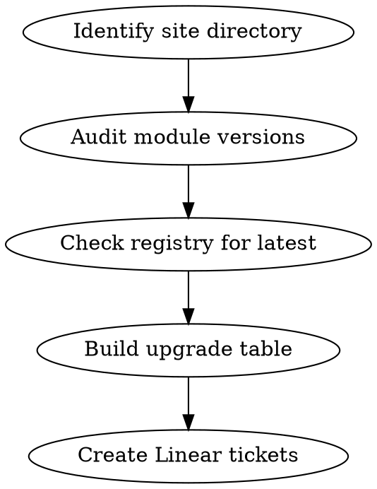

# Tofu Module Debt Tracker

## Overview

Audit OpenTofu/Terraform module versions in a site, compare against latest registry versions, and create structured Linear tickets to track upgrades.

## When to Use

- Starting module upgrade work on a new site
- Creating Linear tickets for technical debt tracking
- Auditing module version drift across infrastructure sites

## Workflow



## Step 1: Audit Module Versions

Search all `.tf` files (excluding `.terraform/`) for versioned registry modules:

```bash
grep -r 'version\s*=\s*"~>' /path/to/site --include="*.tf" | grep -v '.terraform/'
```

For each module, capture:
- File path (relative to site root)
- Module name
- Source (e.g., `terraform-aws-modules/vpc/aws`)
- Current version constraint

## Step 2: Check Latest Versions

For each unique module source, fetch the latest version from the Terraform Registry:

```
https://registry.terraform.io/modules/{source}/latest
```

Compare current constraint against latest. Flag modules where the major version differs.

## Step 3: Build Upgrade Table

| Module | Current | Latest | Gap | File(s) |
|---|---|---|---|---|
| **source/name** | ~> X.Y | A.B.C | N majors | `path/to/file.tf` |

Exclude modules already on latest major version.

## Step 4: Create Linear Tickets

### Prerequisites

Gather from Linear before creating tickets:
- **Parent issue ID** — the site sub-issue to nest under (e.g., `SRE-416`)
- **Team ID** — use `list_teams`
- **Project ID** — use `list_projects`
- **Assignee ID** — use `list_users`
- **Label IDs** — use `list_issue_labels`

### Ticket Hierarchy

```
Technical Debt (parent — may already exist)
└── {Site Name} (sub-issue)
    ├── Upgrade {module} from {old} to {new}
    ├── Upgrade {module} from {old} to {new}
    └── ...
```

### Per-Upgrade Ticket Template

**Title:** `Upgrade {module-short-name} from v{old} to v{new}`

**Description:**
```markdown
**Module:** `{full-source}`
**Current:** ~> {old} | **Target:** ~> {new}
**Gap:** {N} major version(s)

**Files:**
- `{relative-path-1}`
- `{relative-path-2}`
```

**Properties:**
- Labels: `infrastructure`, `chore`
- Priority: 3 (Medium)
- State: Backlog

### Linear Tool Calls

Use `save_issue` for each ticket:

```
save_issue(
  title: "Upgrade {module} from v{old} to v{new}",
  team: "{team-id}",
  project: "{project-id}",
  assignee: "{user-id}",
  labels: ["infrastructure", "chore"],
  priority: 3,
  state: "Backlog",
  parentId: "{parent-issue-id}",
  description: "..."
)
```

Create the site sub-issue first, then create upgrade tickets with `parentId` pointing to the site issue.

## Quick Reference

| Step | Tool | Purpose |
|---|---|---|
| Find modules | `grep` on `.tf` files | Audit current versions |
| Check latest | Terraform Registry API | Compare versions |
| Find team | `list_teams` | Get team ID |
| Find project | `list_projects` | Get project ID |
| Find user | `list_users` | Get assignee ID |
| Find labels | `list_issue_labels` | Get label IDs |
| Create ticket | `save_issue` | Create Linear issue |

## Common Mistakes

- **Searching `.terraform/`** — cached modules pollute results with duplicate/outdated versions
- **Missing file paths** — always include affected files in ticket description so the implementer knows scope
- **Forgetting `parentId`** — tickets without it won't nest properly in the hierarchy
- **Not checking existing parent** — the "Technical Debt" parent issue may already exist from a previous site audit
